[](https://clojars.org/org.clojars.rorokimdim/mindra)
[](https://cljdoc.org/d/org.clojars.rorokimdim/mindra)

# mindra-clj

A 2D graphics library for clojure using [mindra](https://github.com/rorokimdim/mindra) -- a cli for [diagrams](https://diagrams.github.io/)
and [gloss](http://gloss.ouroborus.net/).

# Installation

**A.** Install mindra from [mindra-binary](https://github.com/rorokimdim/mindra#installation)

If you encounter any problems, please file an issue.

**B.** Set up a clojure project

**Leiningen/Boot**

```clojure
[org.clojars.rorokimdim/mindra "0.0.4"]
```

**deps.edn**

```clojure
org.clojars.rorokimdim/mindra {:mvn/version "0.0.4"}
```

# Usage

`mindra` has two set of functions (APIs): [one](https://github.com/rorokimdim/mindra-clj/blob/master/src/mindra/diagrams.clj) for diagrams and [another](https://github.com/rorokimdim/mindra-clj/blob/master/src/mindra/gloss.clj) for gloss. They are not intended to be used together: when creating a gloss picture, we should avoid using functions from the diagrams namespace, and vice versa.

Try drawing a simple circle in a repl:

**A circle using Diagrams**

```clojure
(require '[mindra.core :refer [diagram->svg]])
(require '[mindra.diagrams :as md])

(defn draw-circle [radius]
  (let [svg (diagram->svg (md/circle radius))]
    (spit "circle.svg" svg)))

; Writes to "circle.svg" file.
; For other formats, try mindra.core/diagram->file.
; For displaying the image in a gui window, try mindra.core/show-diagram
(draw-circle 100)
```

**A circle using Gloss**

```clojure
(require '[mindra.core :refer [gloss-draw]])
(require '[mindra.gloss :as mg])

(defn draw-circle [radius]
  (let [picture (mg/circle radius)]
    (gloss-draw picture)))

(draw-circle 100)
```

Hit `ESC` to close the window. See [default-key-bindings](https://github.com/benl23x5/gloss#usage).

Next, checkout the [examples](https://github.com/rorokimdim/mindra-clj#examples).

# Q/A

**A.** How does it compare with library x?

tldr; I don't know yet or I may not have tried it.

I wanted something like [htdp/image](https://docs.racket-lang.org/teachpack/2htdpimage.html), [2htdp/universe](https://docs.racket-lang.org/teachpack/2htdpuniverse.html) for clojure, without the pain (and required skillset) of building it myself. Leveraging diagrams and gloss, which I was already familiar with, seemed like the easiest solution.

**B.** Why is the graphics not as smooth as in library x?

`mindra` inherits all the tradeoffs made by `diagrams` and `gloss`, and all their deficiencies. It also has quirks of its own and, at this stage, probably plenty of bugs too.

However, if you observe poorer graphics with `mindra` compared to diagrams/gloss, please file an issue.

**C.** Will it support feature x?

Please file an issue/feature-request.

**D.** Babashka, GraalVM?

As long as mindra binary is available, this library is expected to work in both! If it doesn't, please file an issue.

# Examples

## Diagrams

SVGs can be created using `diagrams` library. Please check out <a href="https://diagrams.github.io/">diagrams.github.io</a> to learn more.

Only a small subset of the features provided by `diagrams` is supported at this time.

<table>
  <tr>
    <td>
      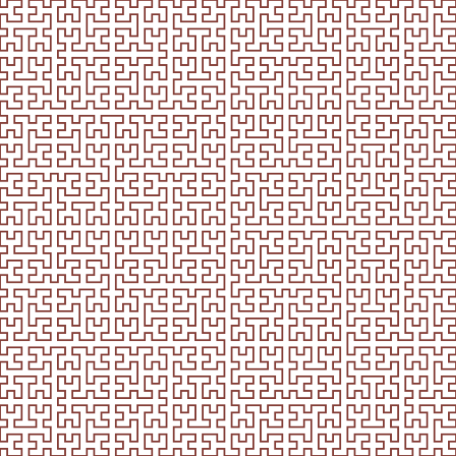
      <a href="https://github.com/rorokimdim/mindra-clj/blob/0707467c4b0822b7173c5df8bf05edba94b8005c/dev/mindra/examples/diagrams.clj#L130">source</a>
    </td>
    <td>
      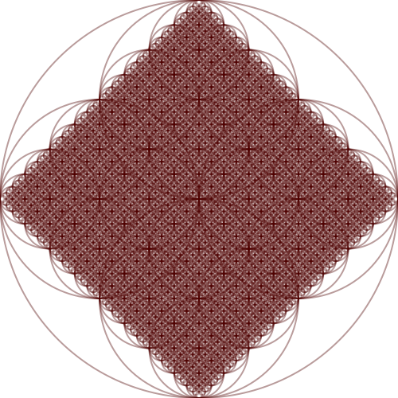
      <a href="https://github.com/rorokimdim/mindra-clj/blob/0707467c4b0822b7173c5df8bf05edba94b8005c/dev/mindra/examples/diagrams.clj#L118">source</a>
    </td>
    <td>
      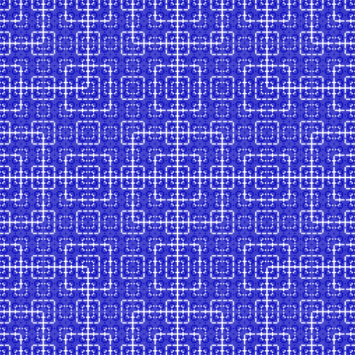
      <a href="https://github.com/rorokimdim/mindra-clj/blob/0707467c4b0822b7173c5df8bf05edba94b8005c/dev/mindra/examples/diagrams.clj#L160">source</a>
    </td>
  </tr>
  <tr>
    <td>
      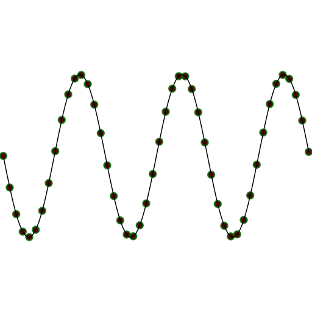
      <a href="https://github.com/rorokimdim/mindra-clj/blob/0707467c4b0822b7173c5df8bf05edba94b8005c/dev/mindra/examples/diagrams.clj#L232">source</a>
    </td>
    <td>
    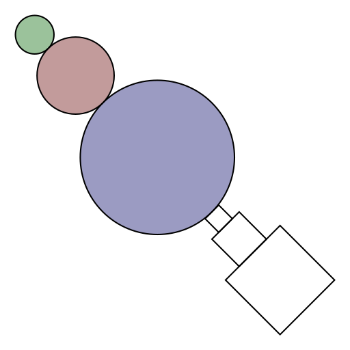
    <a href="https://github.com/rorokimdim/mindra-clj/blob/0707467c4b0822b7173c5df8bf05edba94b8005c/dev/mindra/examples/diagrams.clj#L86">source</a>
    </td>
    <td>
      
      <a href="https://github.com/rorokimdim/mindra-clj/blob/0707467c4b0822b7173c5df8bf05edba94b8005c/dev/mindra/examples/diagrams.clj#L12">source</a>
    </td>
  </tr>
    <tr>
    <td>
      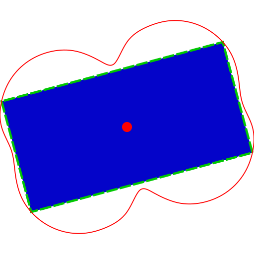
      <a href="https://github.com/rorokimdim/mindra-clj/blob/0707467c4b0822b7173c5df8bf05edba94b8005c/dev/mindra/examples/diagrams.clj#L187">source</a>
    </td>
    <td>
    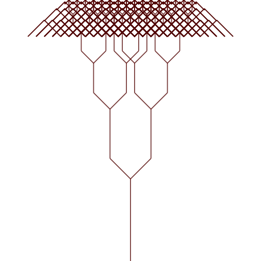
    <a href="https://github.com/rorokimdim/mindra-clj/blob/0707467c4b0822b7173c5df8bf05edba94b8005c/dev/mindra/examples/diagrams.clj#L173">source</a>
    </td>
    <td>
      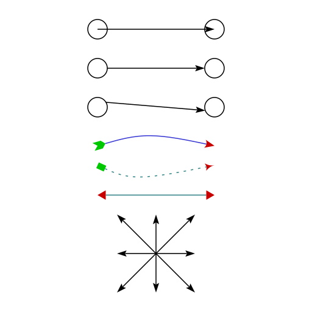
      <a href="https://github.com/rorokimdim/mindra-clj/blob/0707467c4b0822b7173c5df8bf05edba94b8005c/dev/mindra/examples/diagrams.clj#L39">source</a>
    </td>
  </tr>
    </tr>
    <tr>
    <td>
      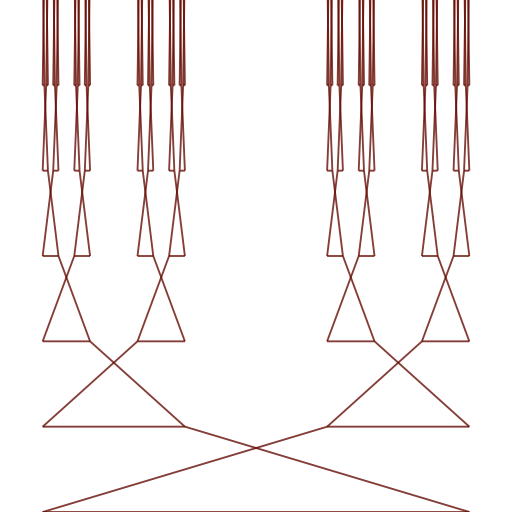
      <a href="https://github.com/rorokimdim/mindra-clj/blob/0707467c4b0822b7173c5df8bf05edba94b8005c/dev/mindra/examples/diagrams.clj#L143">source</a>
    </td>
    <td>
      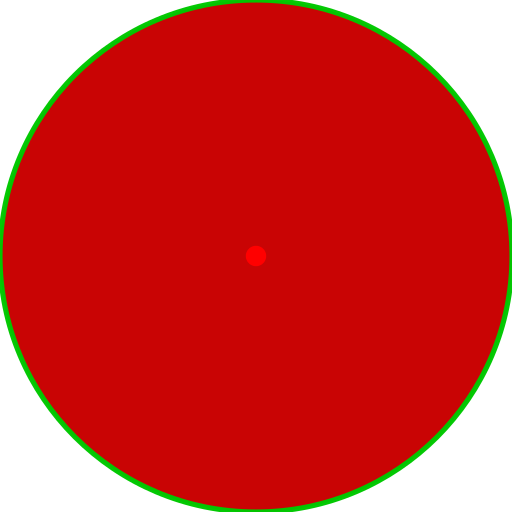
      <a href="https://github.com/rorokimdim/mindra-clj/blob/0707467c4b0822b7173c5df8bf05edba94b8005c/dev/mindra/examples/diagrams.clj#L107">source</a>
    </td>
    <td>
      
      <a href="https://github.com/rorokimdim/mindra-clj/blob/0707467c4b0822b7173c5df8bf05edba94b8005c/dev/mindra/examples/diagrams.clj#L223">source</a>
    </td>
  </tr>
</table>

## Gloss

Please check out <a href="http://gloss.ouroborus.net/">gloss.ouroborus.net</a> to learn more.

A good subset of the features provided by `gloss` is already supported.

**A.** Basic drawing

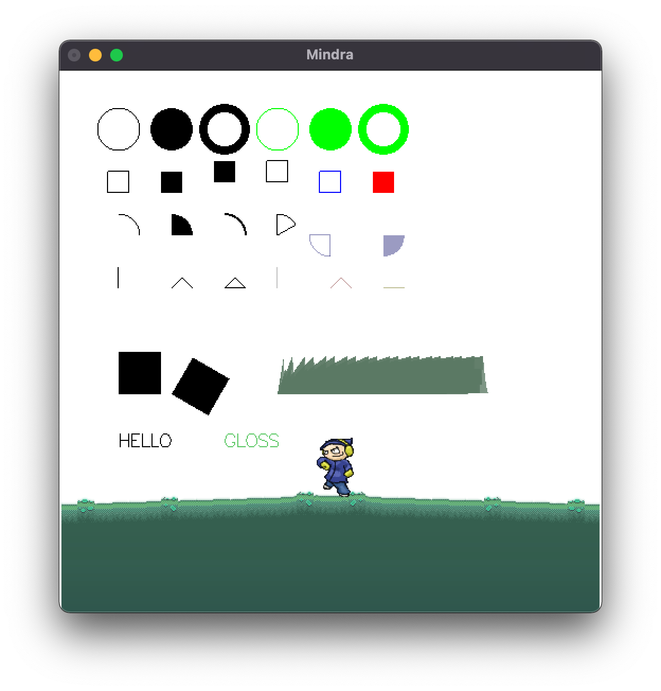

<a href="https://github.com/rorokimdim/mindra-clj/blob/f5b787a9c7be6784bbc3eac953723d87e3ca2130/dev/mindra/examples/gloss.clj#L8">source</a> (images used obtained from [dumbmanex.com](https://github.com/rorokimdim/mindra-clj/blob/master/images/dumbmanex.com/credits.txt))

**B.** Hilbert curve animation

https://user-images.githubusercontent.com/929342/160046861-e0f61455-adc0-48c8-8882-ddef80f55d18.mov

<a href="https://github.com/rorokimdim/mindra-clj/blob/f5b787a9c7be6784bbc3eac953723d87e3ca2130/dev/mindra/examples/gloss.clj#L186">source</a> (images obtained from [dumbmanex.com](https://github.com/rorokimdim/mindra-clj/blob/master/images/dumbmanex.com/credits.txt))

**C.** Snowballer animation

https://user-images.githubusercontent.com/929342/160048147-2fc39ea7-feb1-409e-adb1-288a869fe4ff.mov

<a href="https://github.com/rorokimdim/mindra-clj/blob/f5b787a9c7be6784bbc3eac953723d87e3ca2130/dev/mindra/examples/gloss.clj#L139">source</a>

**D.** Simple animation with event handling

https://user-images.githubusercontent.com/929342/160048948-8acfbca6-63c7-4cfe-9adb-e3418b414807.mov

<a href="https://github.com/rorokimdim/mindra-clj/blob/f5b787a9c7be6784bbc3eac953723d87e3ca2130/dev/mindra/examples/gloss.clj#L117">source</a>


## Credits

0. [Clojure](https://clojure.org/)
1. [Diagrams](https://diagrams.github.io/) and [Gloss](https://hackage.haskell.org/package/gloss)
2. All of these [libraries](https://github.com/rorokimdim/mindra-clj/blob/master/project.clj)

## License

Copyright © 2022 Amit Shrestha

This program and the accompanying materials are made available under [MIT License](https://opensource.org/licenses/MIT)
