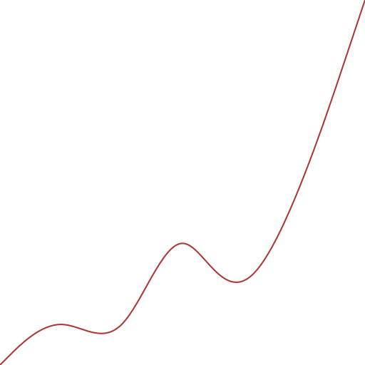

# mindra-clj

A 2D graphics library for clojure using [mindra](https://github.com/rorokimdim/mindra) -- a cli for [diagrams](https://diagrams.github.io/)
and [gloss](http://gloss.ouroborus.net/).

# Examples

## Diagrams

SVGs can be created using `diagrams` library. Please check out <a href="https://diagrams.github.io/">diagrams.github.io</a> to learn more.

Only a small subset of the features provided by `diagrams` is supported at this time.

<table>
  <tr>
    <td>
      
      <a href="https://github.com/rorokimdim/mindra-clj/blob/c4321a9dee1bf35c18ebedcf1f90bca3e5e9eda1/dev/mindra/examples/diagrams.clj#L135">source</a>
    </td>
    <td>
      
      <a href="https://github.com/rorokimdim/mindra-clj/blob/c4321a9dee1bf35c18ebedcf1f90bca3e5e9eda1/dev/mindra/examples/diagrams.clj#L121">source</a>
    </td>
    <td>
      
      <a href="https://github.com/rorokimdim/mindra-clj/blob/c4321a9dee1bf35c18ebedcf1f90bca3e5e9eda1/dev/mindra/examples/diagrams.clj#L165">source</a>
    </td>
  </tr>
  <tr>
    <td>
      
      <a href="https://github.com/rorokimdim/mindra-clj/blob/c4321a9dee1bf35c18ebedcf1f90bca3e5e9eda1/dev/mindra/examples/diagrams.clj#L226">source</a>
    </td>
    <td>
    
    <a href="https://github.com/rorokimdim/mindra-clj/blob/c4321a9dee1bf35c18ebedcf1f90bca3e5e9eda1/dev/mindra/examples/diagrams.clj#L91">source</a>
    </td>
    <td>
      
      <a href="https://github.com/rorokimdim/mindra-clj/blob/c4321a9dee1bf35c18ebedcf1f90bca3e5e9eda1/dev/mindra/examples/diagrams.clj#L16">source</a>
    </td>
  </tr>
    <tr>
    <td>
      
      <a href="https://github.com/rorokimdim/mindra-clj/blob/c4321a9dee1bf35c18ebedcf1f90bca3e5e9eda1/dev/mindra/examples/diagrams.clj#L195">source</a>
    </td>
    <td>
    
    <a href="https://github.com/rorokimdim/mindra-clj/blob/c4321a9dee1bf35c18ebedcf1f90bca3e5e9eda1/dev/mindra/examples/diagrams.clj#L179">source</a>
    </td>
    <td>
      
      <a href="https://github.com/rorokimdim/mindra-clj/blob/c4321a9dee1bf35c18ebedcf1f90bca3e5e9eda1/dev/mindra/examples/diagrams.clj#L44">source</a>
    </td>
  </tr>
    </tr>
    <tr>
    <td>
      
      <a href="https://github.com/rorokimdim/mindra-clj/blob/c4321a9dee1bf35c18ebedcf1f90bca3e5e9eda1/dev/mindra/examples/diagrams.clj#L148">source</a>
    </td>
    <td>
      
      <a href="https://github.com/rorokimdim/mindra-clj/blob/c4321a9dee1bf35c18ebedcf1f90bca3e5e9eda1/dev/mindra/examples/diagrams.clj#L111">source</a>
    </td>
    <td>
      
      <a href="https://github.com/rorokimdim/mindra-clj/blob/c4321a9dee1bf35c18ebedcf1f90bca3e5e9eda1/dev/mindra/examples/diagrams.clj#L217">source</a>
    </td>
  </tr>
</table>

## Gloss

Please check out <a href="http://gloss.ouroborus.net/">gloss.ouroborus.net</a> to learn more.

A good subset of the features provided by `gloss` is already supported.

https://user-images.githubusercontent.com/929342/160046861-e0f61455-adc0-48c8-8882-ddef80f55d18.mov

<a href="https://github.com/rorokimdim/mindra-clj/blob/c4321a9dee1bf35c18ebedcf1f90bca3e5e9eda1/dev/mindra/examples/gloss.clj#L186">source</a>

https://user-images.githubusercontent.com/929342/160048147-2fc39ea7-feb1-409e-adb1-288a869fe4ff.mov

<a href="https://github.com/rorokimdim/mindra-clj/blob/c4321a9dee1bf35c18ebedcf1f90bca3e5e9eda1/dev/mindra/examples/gloss.clj#L139">source</a>

https://user-images.githubusercontent.com/929342/160048948-8acfbca6-63c7-4cfe-9adb-e3418b414807.mov

<a href="https://github.com/rorokimdim/mindra-clj/blob/c4321a9dee1bf35c18ebedcf1f90bca3e5e9eda1/dev/mindra/examples/gloss.clj#L117">source</a>

## Credits

0. [Clojure](https://clojure.org/)
1. [Diagrams](https://diagrams.github.io/)
2. [Gloss](https://hackage.haskell.org/package/gloss)
3. [Mindra](https://github.com/rorokimdim/mindra)
4. All of these [libraries](https://github.com/rorokimdim/mindra-clj/blob/master/project.clj)

## License

Copyright © 2022 Amit Shrestha

This program and the accompanying materials are made available under [MIT License](https://opensource.org/licenses/MIT)
